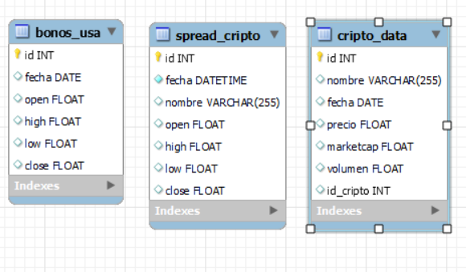

<h1 align='center'>
 <b>PROYECTO INDIVIDUAL Nº2</b>
</h1>
 
# <h1 align="center">**`Cryptocurrency Market Data Analytics`**</h1>
¡Bienvenidos al último proyecto individual 2 de la etapa de labs! En esta ocasión, deberán hacer un trabajo situándose en el rol de un ***Data Analyst***.

# Contexto

Somos Analistas de Datos en la empresa de servicios financieros **ACInvest Inc** que se ha interesado en el mercado de criptomonedas debido a su crecimiento exponencial y el potencial de oportunidades de inversión para los clientes. La empresa me asignó la tarea de realizar un análisis exhaustivo para entender mejor el mercado de criptomonedas y presentar los hallazgos y recomendaciones en un informe detallado.

## Contenido

- [Requisitos](#requisitos)
- [Configuración del Entorno](#configuración-del-entorno)
- [Estructura del Proyecto](#estructura-del-proyecto)
- [Extraccion de datos](#extraccion-de-datos)
- [Análisis Exploratorio](#análisis-exploratorio)
- [Modelo de Predicción](#modelo-de-predicción)
- [Resultados y Visualizaciones](#resultados-y-visualizaciones)
- [Contribuciones](#contribuciones)
- [Licencia](#licencia)

## Requisitos

- Python 3.11+
- Bibliotecas requeridas: pandas, sqlalchemy,matplotlib, seaborn, mysql-connector-python, yfinance, pycoingecko.

## Configuración del Entorno

1. Clona este repositorio.
2. Instala las bibliotecas requeridas utilizando el comando:

pip install -r requirements.txt

## Extraccion de datos
La extraccion de datos se realizó desde las siguinetes APIs:
1. API CoinGecko para extraer información sobre la moneda en sí misma (USD). El procedmiento lo puedes ver aca [API Coingecko](Notebook/data_extrac_API_Coingecko.ipynb)
2. API Binance para obtener los precios de apertura cierre, maximos minimos y spread. [API Binance](Notebook/data_spread_API_Binance.ipynb)
3. API yfinance para obtener los precios históricos diarios de los bonos del tesoro de USA. [API yfinance](Notebook/data_bonos_API_yfinance.ipynb)

Estos datos luego almacenados en una base de datos con el nombre de `cripto_db` en MySQL, para luego ser consumidos en los analisis posteriores.

## ***Estructura de los datos en cripto_db***

## Estructura del Proyecto

|-- Dataset/
| |-- df_cripto.csv
| |-- df_total.csv
| |-- df_spread.csv
| |-- df_bonos_usa.csv
|-- Notebooks/
| |-- bonos_database.ipynb
| |-- cripto_database.ipynb
| |-- data_bonos_API_yfinance.ipynb
| |-- data_extrac_API_Coingecko.ipynb
| |-- data_spread_API_Binance.ipynb
| |-- data_totalvol_trade_API_Binance.ipynb
| |-- eda.ipynb
| |-- spread_database.ipynb
| |-- total_volumen_API_Binance.ipynb
|-- README.md
|-- requirements.txt

## Análisis Exploratorio

El análisis exploratorio se realiza en el notebook [eda.ipynb](Notebook/eda.ipynb) Se exploran los datos de criptomonedas, se generan visualizaciones para comprender tendencias y patrones en los precios, capitalización de mercado, volumen y más.

## Modelo de Predicción

El modelo de predicción se encuentra en el notebook `XXX.ipynb`. Se utiliza el algoritmo de Random Forest para predecir tendencias futuras en los precios de criptomonedas y se evalúa el rendimiento del modelo.

## Resultados y Visualizaciones

Los resultados del análisis exploratorio y del modelo de predicción se presentan en forma de visualizaciones en los notebooks correspondientes. Además, se generan gráficos de diferentes tipos para mostrar tendencias, contribuciones y otros aspectos relevantes de los datos.

## Contribuciones

Si deseas contribuir a este proyecto, ¡te damos la bienvenida! Puedes abrir un problema para discutir posibles mejoras o enviar una solicitud de extracción con tus cambios.